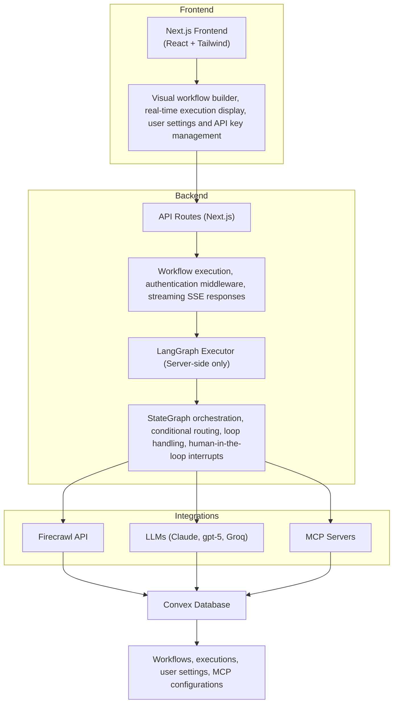

# Open Agent Builder

<p align="center">
  
</p>

<div align="center">

**Build, test, and deploy AI agent workflows with a visual no-code interface**

[](https://choosealicense.com/licenses/mit/)
[](https://firecrawl.dev)

[Documentation](#documentation) • [Examples](#example-workflows)

</div>

---

## What is Open Agent Builder?

Open Agent Builder is a visual workflow builder for creating AI agent pipelines powered by [Firecrawl](https://firecrawl.dev). Design complex agent workflows with a drag-and-drop interface, then execute them with real-time streaming updates.

**Perfect for:**
- Web scraping and data extraction workflows
- Multi-step AI agent pipelines
- Automated research and content generation
- Data transformation and analysis
- Web automation with human-in-the-loop approvals

> **Note:** This project is actively under development. Some features are still in progress and we welcome contributions and PRs!

---

## Key Features

### Visual Workflow Builder
- **Drag-and-drop interface** for building agent workflows
- **Real-time execution** with streaming updates
- **8 core node types**: Start, Agent, MCP Tools, Transform, If/Else, While Loop, User Approval, End
- **Template library** with pre-built workflows
- **MCP protocol support** for extensible tool integration

### Powered by Firecrawl
- **Native Firecrawl integration** for web scraping and searching

### Enterprise Features
- **LangGraph execution engine** for reliable state management
- **Clerk authentication** for secure multi-user access
- **Convex database** for persistent storage
- **API endpoints** for programmatic execution
- **Human-in-the-loop** approvals for sensitive operations

---

## Tech Stack

| Technology | Purpose |
|-----------|---------|
| **[Firecrawl](https://firecrawl.dev)** | Web scraping API for converting websites into LLM-ready data |
| **[Next.js 16 (canary)](https://nextjs.org/)** | React framework with App Router for frontend and API routes |
| **[TypeScript](https://www.typescriptlang.org/)** | Type-safe development across the stack |
| **[LangGraph](https://github.com/langchain-ai/langgraph)** | Workflow orchestration engine with state management, conditional routing, and human-in-the-loop support |
| **[Convex](https://convex.dev)** | Real-time database with automatic reactivity for workflows, executions, and user data |
| **[Clerk](https://clerk.com)** | Authentication and user management with JWT integration |
| **[Tailwind CSS](https://tailwindcss.com/)** | Utility-first CSS framework for responsive UI |
| **[React Flow](https://reactflow.dev/)** | Visual workflow builder canvas with drag-and-drop nodes |
| **[Anthropic](https://www.anthropic.com/)** | Claude AI integration with native MCP support (Claude Haiku 4.5 & Sonnet 4.5) |
| **[OpenAI](https://platform.openai.com/)** | gpt-5 integration (MCP support coming soon) |
| **[Groq](https://groq.com/)** | Fast inference for open models (MCP support coming soon) |
| **[E2B](https://e2b.dev)** | Sandboxed code execution for secure transform nodes |
| **[Vercel](https://vercel.com)** | Deployment platform with edge functions |

---

## Prerequisites

Before you begin, you'll need:

1. **Node.js 18+** installed on your machine
2. **Firecrawl API key** (Required for web scraping) - [Get one here](https://firecrawl.dev)
3. **Convex account** - [Sign up free](https://convex.dev)
4. **Clerk account** - [Sign up free](https://clerk.com)

> **Note:** LLM API keys can be added directly in the UI via Settings → API Keys after setup. For MCP tool support, Anthropic Claude (Haiku 4.5 or Sonnet 4.5) is currently recommended as the default option.

---

## Installation & Setup

### 1. Clone the Repository

```bash
git clone https://github.com/firecrawl/open-agent-builder.git
cd open-agent-builder
npm install
```

### 2. Set Up Convex (Database)

Convex handles all workflow and execution data persistence.

```bash
# Install Convex CLI globally
npm install -g convex

# Initialize Convex project
npx convex dev
```

This will:
- Open your browser to create/link a Convex project
- Generate a `NEXT_PUBLIC_CONVEX_URL` in your `.env.local`
- Start the Convex development server

Keep the Convex dev server running in a separate terminal.

### 3. Set Up Clerk (Authentication)

Clerk provides secure user authentication and management.

1. Go to [clerk.com](https://clerk.com) and create a new application
2. In your Clerk dashboard:
   - Go to **API Keys**
   - Copy your keys
3. Go to **JWT Templates** → **Convex**:
   - Click "Apply"
   - Copy the issuer URL

Add to your `.env.local`:

```bash
# Clerk Authentication
NEXT_PUBLIC_CLERK_PUBLISHABLE_KEY=pk_test_...
CLERK_SECRET_KEY=sk_test_...

# Clerk + Convex Integration
CLERK_JWT_ISSUER_DOMAIN=https://your-clerk-domain.clerk.accounts.dev
```

### 4. Configure Convex Authentication

Edit `convex/auth.config.ts` and update the domain:

```typescript
export default {
  providers: [
    {
      domain: "https://your-clerk-domain.clerk.accounts.dev", // Your Clerk issuer URL
      applicationID: "convex",
    },
  ],
};
```

Then push the auth config to Convex:

```bash
npx convex dev
```

### 5. Set Up Firecrawl (Required)

**Firecrawl is the core web scraping engine** that powers most workflows.

1. Get your API key at [firecrawl.dev](https://firecrawl.dev)
2. Add to `.env.local`:

```bash
# Firecrawl API (REQUIRED)
FIRECRAWL_API_KEY=fc-...
```

> **Note:** Users can also add their own Firecrawl keys in Settings → API Keys, but having a default key in `.env.local` enables the template workflows.

### 6. Optional: Configure Default LLM Provider

While users can add their own LLM API keys through the UI (Settings → API Keys), you can optionally set a default provider in `.env.local`:

```bash
# Optional: Choose one as default

# Anthropic Claude (Recommended - Native MCP support with Haiku 4.5 & Sonnet 4.5)
ANTHROPIC_API_KEY=sk-ant-...

# OpenAI GPT-5 (MCP support coming soon)
OPENAI_API_KEY=sk-...

# Groq (MCP support coming soon)
GROQ_API_KEY=gsk_...
```

> **Important:** For workflows using MCP tools (like Firecrawl integration), Anthropic Claude is currently the recommended provider as it has native MCP support. OpenAI and Groq MCP support is coming soon.

### 7. Optional: E2B Code Interpreter

For advanced transform nodes with sandboxed code execution:

```bash
# E2B Code Interpreter (Optional)
E2B_API_KEY=e2b_...
```

Get your key at [e2b.dev](https://e2b.dev)

---

## Running the Application

### Development Mode

```bash
# Terminal 1: Convex dev server
npx convex dev

# Terminal 2: Next.js dev server
npm run dev
```

Or run both with one command:

```bash
npm run dev:all
```

Visit [http://localhost:3000](http://localhost:3000)

### Production Build

```bash
npm run build
npm start
```

---

## Quick Start Guide

### Your First Workflow

1. **Sign Up/Login** at `http://localhost:3000`
2. **Add your LLM API key** in Settings → API Keys
   - For MCP tool support: Use Anthropic Claude (Haiku 4.5 or Sonnet 4.5)
   - For basic workflows: OpenAI or Groq also work
3. **Click "New Workflow"** or select a template
4. **Try the "Simple Web Scraper" template:**
   - Pre-configured to scrape any website
   - Uses Firecrawl for extraction
   - AI agent summarizes the content
5. **Click "Run"** and enter a URL
6. **Watch real-time execution** with streaming updates

### Understanding Node Types

| Node Type | Purpose | Example Use |
|-----------|---------|-------------|
| **Start** | Workflow entry point | Define input variables |
| **Agent** | AI reasoning with LLMs | Analyze data, make decisions |
| **MCP Tool** | External tool calls | Firecrawl scraping, APIs |
| **Transform** | Data manipulation | Parse JSON, filter arrays |
| **If/Else** | Conditional logic | Route based on conditions |
| **While Loop** | Iteration | Process multiple pages |
| **User Approval** | Human-in-the-loop | Review before posting |
| **End** | Workflow completion | Return final output |

---

## MCP Tool Support

### Current Support
**Anthropic Claude** - Full native MCP support
- Claude Sonnet 4.5 (Recommended)
- Claude Haiku 4.5

Anthropic's MCP implementation provides MCP support, other providers are currently in progress.

### Coming Soon
- **OpenAI** - MCP support in development
- **Gemini** - MCP support in development
- **Open Router** - coming soon...

### Using MCP Tools

MCP tools enable agents to interact with external services like Firecrawl:

1. Add an **Agent** node to your workflow
2. In the node settings, select **MCP Tools**
3. Choose **Firecrawl** or add a custom MCP server
4. The agent can now call Firecrawl tools like `scrape`, `search`, `crawl`

**Example workflow with MCP:**
```
Start → Agent (with Firecrawl MCP) → End
```

The agent can intelligently decide when to scrape pages, search the web, or crawl sites based on your instructions.

---

## Example Workflows

### 1. Simple Web Scraper
**What it does:** Scrape any website and get an AI summary

**Nodes:** Start → Firecrawl Scrape → Agent Summary → End

**Try it:**
```bash
Input: https://firecrawl.dev
Output: "Firecrawl is a web scraping API that converts websites into LLM-ready markdown..."
```

### 2. Multi-Page Research
**What it does:** Search web, scrape top results, synthesize findings

**Nodes:** Start → Firecrawl Search → Loop (Scrape Each) → Agent Synthesis → End

### 3. Competitive Analysis
**What it does:** Research companies, extract structured data, generate report

**Nodes:** Start → Parse Companies → Loop (Research + Extract) → Approval → Export → End

**Features used:**
- Firecrawl web search
- Structured JSON extraction
- While loops for iteration
- Human approval gates
- Conditional routing

### 4. Price Monitoring
**What it does:** Track product prices across multiple sites

**Nodes:** Start → Loop (Scrape + Extract Price) → Compare → Notify → End

---

## Configuration

### User-Level API Keys

Users can add their own API keys via **Settings → API Keys**:

- **LLM Providers:** Anthropic (Recommended for MCP), OpenAI, Groq (Required - add at least one)
- **Firecrawl:** Personal API key (Optional - falls back to environment variable)
- **Custom MCP Servers:** Authentication tokens

This allows:
- Each user to use their own API quotas
- Fallback to environment variables if not set
- Easy key rotation and management

### MCP Server Registry

Add custom MCP servers in **Settings → MCP Registry**:

1. Click "Add MCP Server"
2. Enter server URL and authentication
3. Test connection to discover available tools
4. Use in Agent nodes by selecting from MCP tools dropdown

**Supported MCP Servers:**
- Firecrawl (built-in)
- Custom HTTP endpoints
- Environment variable substitution: `{API_KEY}`

---

## Deployment

### Deploying to Vercel

1. **Push your code to GitHub**

2. **Deploy to Vercel:**
   ```bash
   # Install Vercel CLI
   npm i -g vercel
   
   # Deploy
   vercel
   ```

3. **Set environment variables** in Vercel dashboard:
   - `NEXT_PUBLIC_CONVEX_URL` (from Convex)
   - Clerk keys
   - `FIRECRAWL_API_KEY` (Required)
   - Optional: Default LLM provider keys

4. **Deploy Convex to production:**
   ```bash
   npx convex deploy
   ```

5. **Update Clerk settings:**
   - Add your Vercel domain to allowed origins
   - Update redirect URLs

### Environment Variables Checklist

**Required:**
- `NEXT_PUBLIC_CONVEX_URL` - Convex database
- `NEXT_PUBLIC_CLERK_PUBLISHABLE_KEY` - Clerk auth
- `CLERK_SECRET_KEY` - Clerk auth
- `CLERK_JWT_ISSUER_DOMAIN` - Clerk + Convex integration
- `FIRECRAWL_API_KEY` - Web scraping

**Optional (can be added in UI instead):**
- `ANTHROPIC_API_KEY` - Default Claude provider (Recommended for MCP)
- `OPENAI_API_KEY` - Default gpt-5 provider (MCP coming soon)
- `GROQ_API_KEY` - Default Groq provider (MCP coming soon)
- `E2B_API_KEY` - Sandboxed code execution

## API Usage

### Programmatic Execution

Generate an API key in **Settings → API Keys**, then:

```bash
curl -X POST https://your-domain.com/api/workflows/my-workflow-id/execute-stream \
  -H "Authorization: Bearer sk_live_..." \
  -H "Content-Type: application/json" \
  -d '{"url": "https://example.com"}'
```

**Response:** Server-Sent Events (SSE) stream with real-time updates

## Architecture


</details>

---


## Project Status & Roadmap

### In Progress
- **MCP Support for OpenAI & Groq** - Adding native MCP protocol support
- **OAuth MCP Authentication** - Support for OAuth-based MCP servers
- **Additional MCP Integrations** - More pre-built MCP server connections
- **Workflow Sharing** - Public template marketplace
- **Scheduled Executions** - Cron-based workflow triggers

### Partial Support
- **E2B Code Interpreter** - Transform node sandboxing (requires E2B API key)
- **Complex Loop Patterns** - Nested loops and advanced iteration
- **Custom Node Types** - Plugin system for community nodes

### Coming Soon
- Full MCP support for all LLM providers
- OAuth authentication for MCP servers

We welcome contributions and PRs to help build these features!

## License

This project is licensed under the MIT License 

<div align="center">

**[Star us on GitHub](https://github.com/firecrawl/open-agent-builder)** | **[Try Firecrawl](https://firecrawl.dev)** 

Made with love by the Firecrawl team

</div>